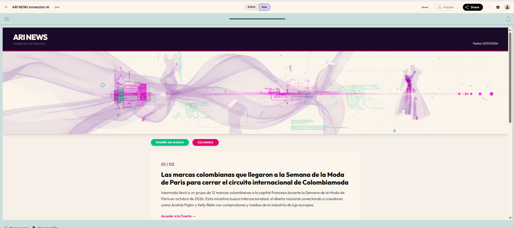
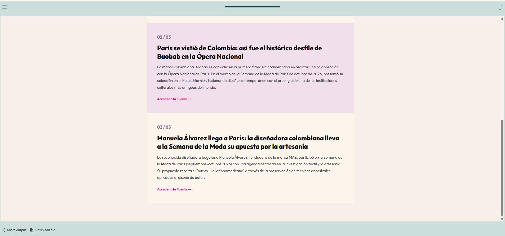

# 🤖 ARI News — Dashboard de Inteligencia Estratégica con Agentes de IA


**ARI News** es un pipeline automatizado de agentes de Inteligencia Artificial que rastrea noticias reales en la web, valida sus enlaces de origen, genera representaciones visuales conceptuales y renderiza un dashboard HTML profesional listo para la toma de decisiones estratégicas.

Proyecto construido durante la **Inmersión Agentes de IA para Negocios** de **Alura Latam**, utilizando **Google Opal**.

🔗 **Ver Aplicación en Google Opal:** [ARI News en Opal](https://opal.google/app/1fkby8tWfZsMY2PEpWPJ7hkf_SL8I-UJf)

---

## 🎯 Objetivos del Proyecto

- **Pipelines de IA vs. Chatbots tradicionales:** Superar la interacción básica por texto creando una secuencia de agentes especializados que colaboran secuencialmente y en paralelo.
- **Grounding Temporal:** Garantizar información actualizada filtrando noticias por sector, región y marco temporal.
- **Prevención de Alucinaciones:** Implementar un nodo de validación de URLs para asegurar que todos los enlaces entregados sean reales y accesibles.
- **Generación Visual & HTML:** Producir imágenes conceptuales abstractas y un panel web en HTML/CSS estructurado sin escribir código manual.

---

## 🧠 Arquitectura del Pipeline de Agentes

El flujo de trabajo en Google Opal se compone de los siguientes agentes:


```

[Entradas de Usuario]
(Sector, Región, Fecha, Nº Noticias)
│
▼
┌───────────────────────────┐
│  Agente 1: Búsqueda Web   │ ──► Filtra y extrae noticias reales
└─────────┬─────────────────┘
│
▼
┌───────────────────────────┐
│  Agente 2: Validador URLs │ ──► Elimina alucinaciones de links
└─────────┬─────────────────┘
│
├────────────────────────────────┐
▼                                ▼
┌───────────────────────────┐    ┌───────────────────────────┐
│ Agente 3: Arte & Branding │    │  Agente 4: Renderizador   │
│   (Prompt de Imagen)      │    │         HTML/CSS          │
└─────────┬─────────────────┘    └─────────┬─────────────────┘
│                                │
└────────────────────────────────┘
│
▼
[ Dashboard Final ARI News ]

```

### Funciones de cada agente:
1. **Agente de Búsqueda de Noticias:** Recibe las variables de entrada (`Sector`, `Región`, `Fecha_noticias`, `Número_noticias`) y recupera la información más reciente.
2. **Agente Validador de Links:** Verifica que las URLs extraídas existan y correspondan exactamente a la fuente de la noticia.
3. **Agente de Generación Visual:** Diseña un arte conceptual abstracto representativo del sector sin texto impreso.
4. **Agente de Interfaz HTML:** Ensambla las noticias, la imagen y la paleta de colores en un dashboard web estilizado y funcional.

---

## 📸 Vista Previa del Dashboard

 



---

## 🛠️ Variables de Entrada Utilizadas

- **`Sector`**: Área de negocio o industria a monitorear (Ej. *Educación Tecnológica, Finanzas, IA*).
- **`Región`**: Ubicación geográfica de las noticias (Ej. *Latinoamérica, Global*).
- **`Fecha_noticias`**: Rango temporal solicitado.
- **`Número_noticias`**: Cantidad dinámica de artículos a listar en el panel.
- **`Sector_o_Tema`**: Tema específico para la imagen de cabecera.
- **`Color_de_Acento`**: Tono secundario para la composición visual.
- **`Efecto_Visual`**: Estilo abstracto de la imagen (Ej. *caminos de luz interconectados*).

---

## 📚 Créditos y Agradecimientos

- **Evento:** Inmersión Agentes de IA para Negocios — Clase 1
- **Organización:** [Alura Cursos](https://www.aluracursos.com/)
- **Herramienta:** [Google Opal](https://opal.google/)

## 📧 Contacto
¿Tienes un proyecto en mente? Conectémonos y hagamos que las cosas sucedan! Puedes escribirme a carolinalopezdatascientist@gmail.com o seguirme en [LinkedIn](https://www.linkedin.com/in/carolina-lopez-430208106/).
<br /><br />
```
